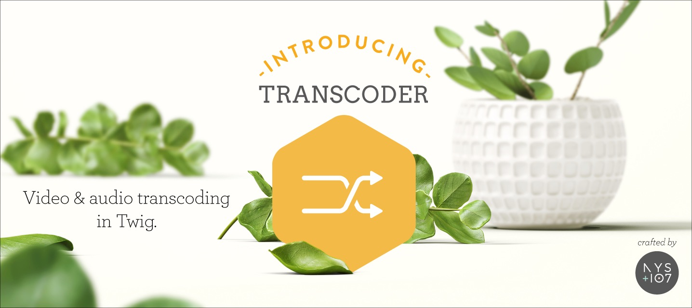

   

# Transcoder plugin for Craft CMS 4.x

Transcode video & audio files to various formats, and provide video thumbnails

## Video workflow features

- Queue newly uploaded video assets through Craft’s queue.
- Delay queued encodes when other asset-save handlers need time to finish.
- Keep the original option-based filenames, including bitrate, or opt into stable source-asset filenames.
- Overlay a configurable watermark on encoded videos.
- Generate named poster formats after queued encodes.
- Replace poster letterboxing with a blurred cover background.
- Refresh managed video derivatives after a third-party plugin replaces a source asset.

All features are disabled by default except the original `options` filename strategy, so existing installations keep their current behavior. Configuration is available from the plugin settings screen or `config/transcoder.php`.

Third-party plugins that intentionally replace a video asset can call `Transcoder::$plugin->getTranscode()->refreshVideoAsset($asset)`. Cleanup and re-encoding run asynchronously through Craft’s queue; see the usage documentation for the integration contract.

**Note**: _The license fee for this plugin is $59.00 via the Craft Plugin Store._

## Requirements

This plugin requires Craft CMS 4.0.0 or later.

## Installation

To install Transcoder, follow these steps:

1. Open your terminal and go to your Craft project:

        cd /path/to/project

2. Then tell Composer to load the plugin:

        composer require nystudio107/craft-transcoder

3. Install the plugin via `./craft install/plugin transcoder` via the CLI, or in the Control Panel, go to Settings → Plugins and click the “Install” button for Transcoder.

You can also install Transcoder via the **Plugin Store** in the Craft Control Panel.

Transcoder works on Craft 4.x.

You will also need [ffmpeg](https://ffmpeg.org/) installed for Transcoder to work. On Ubuntu 16.04, you can do just:

    sudo apt-get update
    sudo apt-get install ffmpeg

To install `ffmpeg` on Centos 6/7, you can follow the guide [How to Install FFmpeg on CentOS](https://www.vultr.com/docs/how-to-install-ffmpeg-on-centos)

If you have managed hosting, contact your sysadmin to get `ffmpeg` installed.

## Documentation

Click here -> [Transcoder Documentation](https://nystudio107.com/plugins/transcoder/documentation)

## Transcoder Roadmap

Some things to do, and ideas for potential features:

* Add a console command for doing encodings via console
* Figure out a way to reliably do multi-pass video encoding
* Add audio normalization via `loudnorm` http://k.ylo.ph/2016/04/04/loudnorm.html

Brought to you by [nystudio107](https://nystudio107.com)
